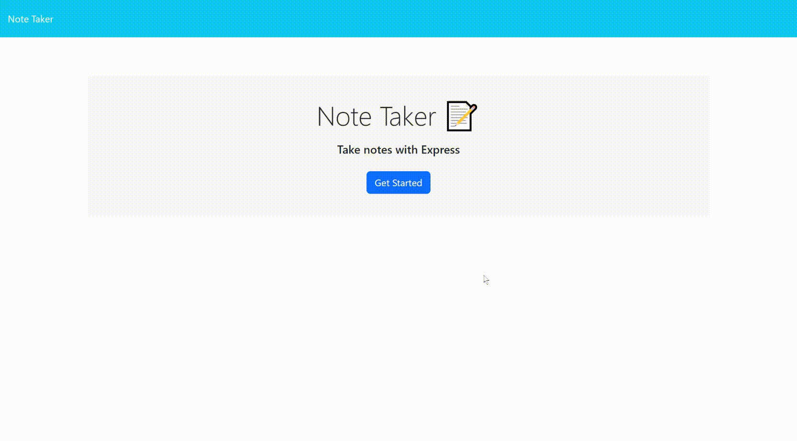

# Express-Note-Taker

### **[Description](#description) | [Installation](#installation) | [Usage](#usage) | [Credits](#credits) | [License](#license) | [Contribute](#contribute) | [Tests](#tests) | [Questions](#questions)**

## Description

My motivation is to create a working note taking application.

I built this project for users to easily create, store, and delete notes using Express API. 

This creates a webpage that utilizes both front-end and back-end features to create a functional note taking application.

I learned how to utilize Express and (somewhat) Heroku.

## Installation

The application webpage is: link.

Or you can download or fork this package. From there, open the integrated terminal (this is for VSCode) and run the following: 1. 1. `npm i`, 2. `npm run start`. 

## Usage

When you hit the landing page, click the "Get Started" button. You'll be redirected to the Notes page. From there, you can type in your note (**NOTE:** must include both a title and text body to save), and then select the save icon to save your notes. The note will be added to the left-hand column, where you can select your note to view it. 

To delete your note, select the trashcan icon next to the desired note. And use the **+** icon to add new notes.

Selecting the "Note Taker" title in the corner will redirect you to the landing page.

## Credits

- Collaborators: 
  - N/A.
- Third-party assets: 
  - https://expressjs.com/
- Tutorials: 
  - UCSD-VIRT-FSF-PT-03-2023-U-LOLC
  - https://chat.openai.com/share/985493f2-5276-4d82-95cf-b426d77f13f4

## License

 The license this application is covered under is: [MIT License](https://mit-license.org/).

## Contribute

In general, follow the "fork-and-pull" Git workflow.

  1. **Fork** the repo on GitHub.
  2. **Clone** the project to your own machine.
  3. **Commit** changes to your own branch.
  4. **Push** your work back up to your fork.
  5. Submit a **pull request** so that your changes can be reviewed.
    
  NOTE: Be sure to merge the latest from "upstream" before making a pull request!
  
  When contributing to this project, please follow the [Contributor Covenant](https://www.contributor-covenant.org/version/2/1/code_of_conduct/) code of conduct.

## Tests

None.

## Questions

My gitHub username is [itsa-me-dea](https://github.com/itsa-me-dea), and you can contact me at wachadea@gmail.com.